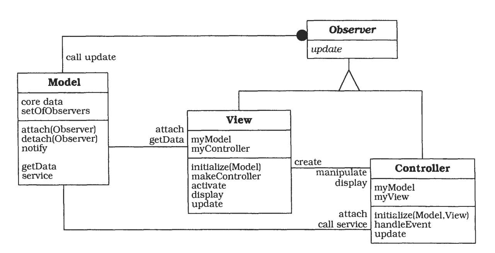

# What is a pattern?

Patterns help you build on the collective experience of skilled software engineers. They capture existing, well-proven experience in software development and help to promote good design practise.

Every patterns deals with a specific, recurring problem in the design or implementation of a software system.
Patterns can be used to construct software architectures with specific properties.

In this chapter we give an in-depth explanation of what patterns for software architecture are, and how they help you build software.

When experts work on a particular problem, it is unusual for them to tackle it by inventing a new solution that is completely distinct from existing ones.

They often recall a similar problem they have already solved, and reuse the essence of its solution to solve the new problem.
This kind of 'expert behavior', the thinking in problem-solution pairs, is common to many different domains, such as architecture, economics and software enginering.
It is a natural way of coping with any kind of problem or social interaction.
Here is an elegant and intuitive example of such a problem-solution pair, taken from architecture:

# Example: Window place

Everybody loves window seats, bay windows, and big windows with low sills and comfortable chairs drawn up to them...

A room which does not have a place like this seldom allows you to feel comfortable and perfectly at ease ...

If the room contains no window which is a 'place', a person in the room will be torn between two forces:
1. He wants to sit down and be comfortable.
2. He is drawn toward the light.

Obviously, if the comfortable places-those places in the room where you most want to sit- are away from the windows, there is no way of overcoming this conflict...

Therefore: In every room where you spend any length of time during the day, make at least on window into a 'window place'.

Abstracting from specific problem-solution pairs and distilling out common factors leads to patterns: These problem-solution pairs tend to fall into famillies of similar problems and solutions with each family exhibiting a pattern in both the problems and the solutions.

In his book *The Timeless Way of Building*, the architect Christopher Alexander defines the term pattern as follows:
Each pattern is a three-part rule, which expresses a relation between a certain context, a problem, and a solution.

> As an element in the world, each pattern is a relationship between a certain context, a certain system of forces which occurs repeatedly in that context, and a certain spatial configuration which allows these forces to resolve themselves.
>
> As an element of language, a pattern is an instruction, which shows how this spatial configuration can be used, over and over again, to resolve the given system of forces, wherever the context makes it relevant.
>
> The pattern is, in short, at the same time a thing, which happens in the world, and the rule which tells us how to create the thing, and when we must create it. It is both a process and a thing; both a description of a thing which is alive, and a description of the process which will generate that thing.

We also find may patterns in software architecture. Experts in software engineering know these patterns from practical experience and follow them in developing applications with specific properties.
They use them to solve design problems both effectively and elegantly.
Before discussing this in detail, let us look at a well-known example.

# Example: Model-View-Controller.

Consider this pattern when developing software with a human computer interface.
User interfaces are prone to change requests. For example, when extending the functionality of an application, menus have to be modified to access new functions, and user interfaces may have to be adapted for specific customers.
A system may often have to be ported to another platform with a different 'look and feel' standard.
Even upgrading to a new release of your window system can imply changes to your code.
To summarize, the user interface of long-lived system is a moving target.

Building a system with the required flexibility will be expensive and error-prone if the user interface is tightly interwoven with the functional core. This can result in the development and maintenance of several substantially different software systems, one of each user interface implementation. Ensuing changes then spread over many modules.

In summary, when developing such an iteractive software system, you have to consider two aspects:
1. Changes to the user interface should be easy, and possible at run-time.
2. Adapting or porting the user interface should not impact code in the functional core of the application.

To solve the problem, divide an interactive application into three areas: **processing, output and input**.

1. The **model** component encapsulates core data and functionality. The model is independent of specific output representations or input behavior.
2. **View** components display information to the user. A view obtains the data it displays from the model. There can be multiple views of the model.
3. Each view has an associated **controller** component. Controllers receive input, ususally as events that denote mouse movement, activation of mouse buttons or keyboard input. Events are translated to service requests, which are sent either to the model or to the view. The user interacts with the system solely via controllers.

The separation of the model from the view and controller components allows multiple views of the same model. If the user changes the model via the controller of one view, all other views dependent on this data should reflect the change. To achieve this, the model notifies all views whenever its data changes. The views in turn retrieve new data from the model and update their displayed information.

This solution allows you to change a subsystem of the application without causing major effects to other subsystems. For example, you can change from a non-graphical to a graphical user interface without modifying the model subsystem. You can also add support for a new input device without affecting information display or the functional core. All versions of the software can operate on the same model subsystem independently of specific 'look and feel'.

The following OMT class diagram illustrates this solution:

# Properties of patterns

We can derive serveral properties of patterns for software architecture from this introductory example:

**A pattern addresses a recurring design problem that arises in specific design situations, and presents a solution to it.** In our example here the problem is supporting variability in user interfaces. This problem may arise when developing software systems with human-computer interaction. You can solve this problem by a strict separation of responsibilities: the core functionality of the application is separated from its user interface.

**Patterns document existing, well-proven design experience.** They are not invented or created artificially. Rather they *distill and provide a means to reuse the design knowledge gained by experienced practitioners*. Those familiar with an adequate set of patterns 'can apply them immediately to design problems without having to rediscover them'. Instead of knowledge existing only in the heads of a few experts, patterns make it more generally available. You can use such expert knowledge to desing high-quality software for a specific task. The Model-View-Controller pattern, for example, presents experience gained over many years of developing interactive systems. Many well-know apllications already apply the Model-View-Controller pattern. It is the classical architecture for many Smalltalk applications, and underlies several application frameworks such as MacApp or ET++.

**Patterns identify and specify abstractions that are above the level of single classes and instances, or of components**. Typically, a pattern describes serveral components, classes or objects, and details their responsibilities and relationships, as well as their cooperation. All components together solve the problem that the pattern addresses, and usually more effectively than a single component. For example, the Model-View-Controller pattern describes a triad of three cooperating components, and each MVC triad also cooperates with other MVC triads of the system.

**Patterns provide a common vocabulary and understanding for design principles**. Pattern names, if chosen carefully, become part of a widespread design language. They facillitate effective discussion of design problems and their solutions. They remove the need to explain a solution to a particular problem with a lengthy and complicated description. Instead you can use a pattern name, and explain which parts of a solution correspond to which components of the pattern, or to which relationships between them. For example, the name *Model-View-Controller* and the associated pattern has been well-known to the Smalltalk community since the early '80s, and is used by many software engineers. When they say 'the architecture of the software follows Model View Controller', all our colleagues who are familiar with the pattern have an idea of the basic structure and properties of the application immediately.

**Patterns are a means of documenting software architectures**. They can describe the vision you have in mind when desiging a software system. This helps others to avoid violating this vision when extending and modifying the original architecture, or when modifying the system's code. For example, if you know that a system is structured according to the Model-View-Controller pattern, you also know how to extend it with a new function: keep core functionality separate from user input and information display.

**Patterns support the construction of software with defined properties**. Patterns provide a skeleton of functional behavior and therefore help to implement the functionality of your application. For example, patterns exist for maintaining consistency between cooperating components and for providing transparent peer-to-peer inter-process-communication. In addition, patterns explicitly address non-functional requirements for software systems, such as changeability, reliability, testability or reusability. The Model-View-Controller pattern, for example, supports the changeability of user interfaces and the reusability of core functionality.

**Patterns help you build complex and heterogeneous software architecture**. Every pattern provides a predefined set of components, roles and relationships between them. It can be used to specify particular aspects of concrete software structures. Patterns act as building blocks for constructing more complex designs. This method is using predeined design artifacts supports the speed and the quality of your design. Understanding and applying well-written patterns saves time when comparing to searching for solutions on your own. This is not to say that individual patterns will necessarily be better than your own solutions, but, at the very least, a pattern system such as is explained in this book can help you to evaluate and assess design alternatives.

However, although a pattern determines the basic structure of the solution to a particular design problem,it does not specify a fully detailed solution. A pattern provides a scheme for a generic solution to a family of problems, rather than a prefabricated module that can be used 'as is'. You must implement a scheme according to the specific needs of the design problem at hand. A pattern helps with the creation of similar units. These units can be alike in their broad structure, but are frequently quite different in their detailed appearance. Patterns help solve problems, but they do not provide complete solutions.

**Patterns help you to manage software complexity**. Every pattern describes a proven way to handle the problem it addresses: the kinds of components needed, their roles, the details that should be hidden, the abstractions that should be visible, and how everything works. When you encounter a concrete design situation covered by a pattern there is no need to waste time inventing a new solution to your problem. If you implement the pattern correctly, you can rely on the solution it provides. The Model-View-Controller pattern, for example, helps you to separate the different user interface aspects of software system and provide appropriate abstractions for them.

We end with the following definition:

> A *pattern for software architecture* describes a particular recurring design problem that arises in specific design contexts, and presents a well-proven generic scheme for its solution. The solution scheme is specified by describing its constituent components, their responsibilities and relationships, and the ways in which they collaborate.